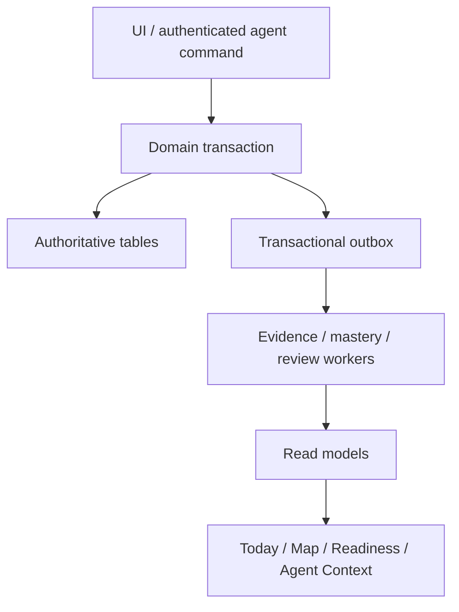

# PANDO — System Architecture v0.3

## 1. Architecture style

Build a modular monolith first:

- one hosted responsive web application as the primary MVP delivery surface;
- one deployable product backend;
- one Postgres database, initially Supabase-managed if retained by the project;
- explicit domain modules matching bounded contexts;
- transactional outbox for reliable internal/integration events;
- idempotent background consumers;
- rebuildable materialized/read projections where necessary;
- asynchronous jobs for imports, recalculations, metadata retrieval, and notifications.

Do not introduce microservices or a graph database until measured workload or team boundaries justify them.

## 2. Logical data flow



An external provider event first enters the integration inbox, is deduplicated and validated, then normalized into a typed observation. Only that normalized observation can enter the Evidence command path. Raw `ProviderEventImported` and session/activity lifecycle events never enter the evidence ledger directly.

## 3. Module contracts

Modules expose commands, queries, and versioned events—not direct cross-module table writes.

Important contracts:

The complete interaction matrix, derived projection ownership, and purpose-specific cross-context
flows are defined in the [module topology](design/MODULE_TOPOLOGY.md) and
[ADR-0009](adr/0009-module-topology-and-projection-ownership.md). The eleven bounded contexts remain
the authoritative owners; rebuildable client projections do not create additional domain owners.

- Catalog publishes canonical competency, activity, resource, and roadmap-template versions and changes.
- Targets owns and publishes target-profile series/versions, target requirements, readiness goals,
  campaign lifecycle changes, and target-specific readiness snapshots calculated from versioned
  Mastery inputs.
- Planning owns the Growth Plan, Learning Tracks, availability/capacity, campaign allocation overrides, and plan snapshots.
- User Overlay owns workspace-scoped competencies and personal catalog deltas; it cannot publish canonical content.
- Evidence accepts normalized observations and publishes ledger append events.
- Mastery consumes evidence changes and publishes competency-state changes.
- Review consumes evidence/mastery/deadlines and publishes review-item changes.
- Planning queries current read models and owns versioned plan snapshots and Today explanations.
- The server-side Explore composer assembles `GraphProjectionV1` from authorized module queries. It
  owns the response contract but no domain rows and has no write path.
- Agent Control publishes minimized read contexts and coordinates confirmed change sets through owning-context commands; it never emits authoritative mastery/evidence facts.
- PyPrep publishes `CardReviewed`, `DeckCompleted`, `RetentionUpdated`, and `ModuleProgressChanged` through an integration adapter.

In a single database these boundaries are enforced in code and tests before physical separation is considered.

## 4. Storage model

Use relational tables for canonical entities and edges. Postgres recursive queries or precomputed closures are sufficient for the initial DAG. JSON may store versioned event payloads and provider metadata, but core searchable/constraint-bearing fields remain typed columns.

Maintain:

- immutable evidence rows and correction records;
- current competency projections keyed by user, competency, and engine version;
- historical calculation snapshots for audit/debugging;
- profile/template versions, never in-place semantic rewrites;
- overlay deltas rather than copied template graphs;
- inbox/outbox idempotency and processing status;
- soft lifecycle states for curated catalog content.

Imported Preparation Packs are stored in three layers:

1. Integrations retains the immutable original file set, fingerprint, schema-validation result, and import status.
2. Targets stages profile/requirement proposals; User Overlay stages proposed workspace-scoped
   competencies, activities, resources, mappings, and edges. Integrations retains the normalized
   plan proposal and preview audit while Planning validates the intended plan/track commands.
3. Confirmation publishes immutable workspace-scoped target-profile versions and accepted personal
   items, then applies accepted Growth Plan, track, capacity, and cadence changes through the owning
   domain commands. Rejection or partial acceptance preserves the original import and decision audit
   without mutating canonical content.

## 5. Deployment and file exchange boundary

PANDO's MVP is a hosted responsive web application. The portable zero-API-cost workflow is:

1. download `preparation-context.json` from PANDO;
2. use it with a prepared prompt in ChatGPT Work;
3. download or locate the generated Preparation Pack;
4. upload the pack through PANDO's browser UI;
5. validate, preview, and confirm it server-side.

A repository folder such as `imports/preparation/` and an optional local watcher are supported only for development or a personal self-hosted workflow. Hosted onboarding, imports, and release acceptance cannot depend on filesystem visibility or a watcher.

## 6. Security and tenancy

- All user-owned rows carry workspace/user ownership as appropriate.
- Enable and test Row Level Security on exposed Supabase tables.
- Browser clients use only least-privilege public/session credentials.
- Secret/service credentials stay on controlled backend/job infrastructure and never ship to clients.
- Authorization is checked in the domain command path even when RLS also applies.
- Provider tokens are encrypted, minimally scoped, revocable, and never logged.
- Audit sensitive mutations and integration connections.
- Export/delete flows must eventually cover evidence, overlays, conversations, and provider links.

No scalability claim is accepted without a workload model and load tests.

## 7. Provider abstraction

Define capability-based interfaces rather than one universal provider:

```text
ActivityCatalogProvider
AttemptEvidenceProvider
ResourceMetadataProvider
RepositoryEvidenceProvider
LearningProvider
NotificationProvider
```

Each adapter declares capabilities, provenance, reliability, cursor/checkpoint, and failure state.

Initial adapters:

1. `ManualProvider` — always available.
2. `PyPrepProvider` — first-party/bounded-context events.
3. `GitHubRepositoryProvider` — optional evidence about commits/files/tests; never claim it proves LeetCode acceptance.
4. `ExternalLinkProvider` — stores links and safe metadata.

The versioned PyPrep contract and its tested mock are release requirements. Connecting a live PyPrep event source is conditional and must not change the domain or evidence contracts.

An official coding-platform adapter may be added only with supported authorization and terms. Do not scrape LeetCode, depend on private GraphQL endpoints, or copy protected statements/solutions.

## 8. Calculation architecture

Mastery, readiness, scheduler, and planner are separate versioned engines.

Every calculation records:

- engine and policy version;
- input watermark or relevant event versions;
- selected template/profile versions;
- output timestamp;
- explanation factors;
- confidence/unknown handling.

Jobs must be idempotent. Late or corrected evidence triggers affected projections. Start with coarse targeted recalculation; optimize incrementally after profiling.

## 9. External Agent Control architecture

Agent Control is a required external-client capability, not an embedded AI provider. ChatGPT Work, Codex, voice, the web UI, and future clients share the same authenticated read and command contracts.

### 9.1 Two different planes

The agent orientation plane helps a coding or operations agent understand the repository:

- `AGENTS.md` and project skills define workflow and safety rules;
- Graphify indexes repository code and documentation for selective navigation;
- generated repository graphs exclude secrets, local state, user exports, caches, and production data;
- Graphify output is an optimization hint and audit map, never product truth, authorization, or a live user-state interface.

The live control plane manages PANDO state:

- `AgentControlContextV1` is a compact root summary capped at 12 KiB;
- detail resources expand one goal, campaign, track, target, blocker, or explanation on demand;
- focused read tools return current versions/watermarks;
- proposal tools create deterministic previews;
- one `ApplyPlanChangeSet` command applies the confirmed preview atomically;
- the same application service and Postgres RPC boundary serves UI, MCP, and local CLI adapters.

Repository files never mirror or become authoritative user plans. An agent must not edit SQL, JSON exports, fixtures, Graphify files, or project documentation to change a live plan.

### 9.2 Transport and tool surface

The hosted adapter exposes Streamable HTTP MCP tools for ChatGPT Work and other compatible clients. A local `pando` CLI adapter gives Codex the same typed operations without adding another domain path. Both call the hosted PANDO application boundary.

Initial focused operations are:

- reads: `get_control_summary`, `get_goal_context`, `explain_today`, `get_change_status`;
- proposals: `preview_create_goal`, `preview_change_goal`, `preview_close_goal`, `preview_change_set`;
- mutation: `apply_change_set` using the preview token, expected versions, base watermark, and idempotency key.

Reads and writes are separate tools. Tool schemas use stable identifiers and bounded payloads; tools never accept arbitrary SQL, file paths, table names, event bodies, or cross-workspace identifiers.

### 9.3 Intent-to-change flow

1. Authenticate the user and resolve the workspace from the session, never from an untrusted model claim.
2. Fetch the root control summary and only the detail resources needed for the request.
3. Map natural language to explicit semantic operations. PANDO itself does not run an LLM for this mapping.
4. Validate permissions, lifecycle rules, cardinality, dates, capacity, and expected aggregate versions.
5. Produce a deterministic preview showing before/after meaning, Today impact, warnings, retained history, and required confirmation.
6. Bind confirmation to the exact preview digest and expiry.
7. Apply the change set as one idempotent transaction with command receipt, plan revision, and transactional outbox.
8. Return the resulting revision/watermark; clients refresh projections using ETag or `changed_since`.

A stale preview, changed aggregate version, expired token, missing confirmation, or invalid operation applies nothing. Long-running recalculation follows through outbox consumers and exposes pending/complete/failed status.

### 9.4 Authentication, privacy, and voice

The hosted MCP endpoint uses OAuth 2.1 user authorization and workspace-scoped permissions. Local development credentials live outside Git and are never copied into skills or Graphify output. Ordinary user commands never use the Supabase service role.

Voice is only an input mode of the connected ChatGPT/Codex client. It receives exactly the same tool permissions, previews, and confirmation requirements as typed input; PANDO does not add a separate voice recording or retention system.

The root context excludes raw evidence bodies, personal notes, provider payloads, secrets, unrelated history, and unrestricted database rows. Expanded resources repeat authorization and return the minimum required fields. Audit records retain operation metadata and user reason, not external model conversation transcripts.

### 9.5 Preparation Pack and embedded AI boundaries

Preparation Packs remain the asynchronous bulk-authoring path for substantial new target profiles, competency proposals, or initial plans. They are validated, previewed, and confirmed through browser upload. They are not the protocol for small live edits such as cancelling a campaign, pausing a track, changing capacity, or moving a deadline.

No embedded model is required. The external user-owned ChatGPT Work/Codex session performs language interpretation, so PANDO's inference cost remains USD 0. A future embedded provider requires the separate approval and safeguards in ADR-0007 and must use these same read/proposal/confirmation contracts.

All model output remains untrusted input. It cannot bypass authorization, invariants, evidence rules, version checks, or user confirmation. Sensitive provider secrets never enter model context.

## 10. Frontend architecture

Use a shared domain-facing client and separate projections for Today, Map, Outline, Review, Focus, and Plan.

For the graph:

- React Flow is an acceptable initial renderer, not a domain model.
- Layout is deterministic and cached; recompute only for structural changes or explicit personal positioning.
- Render the visible subgraph and selected context.
- Memoize nodes/edges and isolate high-frequency gesture state.
- Persist semantic selection/filter/viewport separately from canonical graph data.
- Keep animation tokens centralized and honor reduced/off modes.

The repository design system must own tokens, node states, keyboard behavior, drag/drop contracts, motion rules, and performance budgets. Agent-specific design skills are helpers, not the source of truth.

## 11. Observability

Track technical health:

- command/job success, retries, latency, dead letters;
- provider sync freshness and errors;
- projection lag and recalculation duration;
- API/database performance;
- graph render size/frame performance;
- AI proposal validation/rejection and latency, without logging sensitive content by default.

Track product quality without confusing engagement with learning:

- time to first useful action;
- recommendation accepted/replaced and why;
- focus completion and evidence quality;
- review completion and delayed verification;
- unknown/stale coverage reduction;
- target blockers resolved;
- user corrections to imported evidence/mappings.

## 12. Testing strategy

Required test layers:

- domain invariant tests for DAG, evidence, floors, overlay merge, and state transitions;
- golden tests for calculation versions and explanations;
- property-based tests for idempotency, event order, corrections, and scheduler deduplication;
- RLS/authorization tests across tenants;
- contract tests for providers and event schemas;
- migration tests with versioned templates/profiles;
- end-to-end vertical-slice tests;
- accessibility, keyboard, reduced-motion, interaction, and visual regression tests;
- graph performance tests with representative visible and total sizes;
- failure tests for partial import, delayed events, provider outage, and AI outage.
- Agent Control contract tests for compact-context budgets, tool authorization, cross-workspace isolation, stale previews, idempotent replay, atomic multi-operation rollback, and confirmation binding.
- UI/agent parity scenarios proving that the same lifecycle change produces the same domain result from both clients.

## 13. Resolved Phase 0 technical decisions

The previously open implementation choices are accepted for Phase 0 and indexed in [Phase 0 Technical Baseline](PHASE_0_TECHNICAL_BASELINE.md):

- Next.js 16, React, strict TypeScript, Node.js 24 LTS, and pnpm 11;
- Vercel Hobby for the personal non-commercial web deployment and Supabase Free for Postgres, Auth, Storage, Cron, and the Data API;
- purpose-specific Postgres RPC commands, Row Level Security, and a Postgres transactional outbox without Redis or a separate queue;
- React Flow with deterministic Dagre layout and a server-owned graph projection contract;
- transparent versioned mastery, readiness, and review policies;
- no embedded AI provider or retained AI conversations in MVP;
- an authenticated external Agent Control adapter, compact control context, preview/confirm/apply change sets, and project-local Graphify orientation without live-state files;
- PyPrep always crosses a versioned integration boundary, even if a later deployment shares physical infrastructure.

The accepted decisions, alternatives, security impact, and migration triggers are recorded under [adr/](adr/). Future agents must create a superseding ADR before changing a hard-to-reverse decision.
