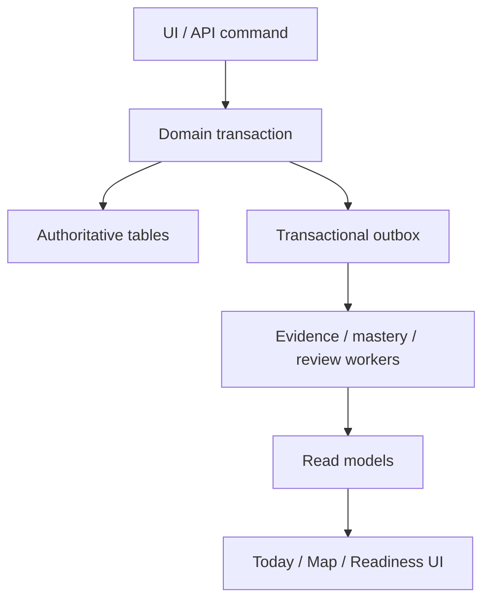

# PANDO — System Architecture v0.2

## 1. Architecture style

Build a modular monolith first:

- one hosted responsive web application as the primary MVP delivery surface;
- one deployable product backend;
- one Postgres database, initially Supabase-managed if retained by the project;
- explicit domain modules matching bounded contexts;
- transactional outbox for reliable internal/integration events;
- idempotent background consumers;
- rebuildable materialized/read projections where necessary;
- asynchronous jobs for imports, recalculations, metadata retrieval, and notifications.

Do not introduce microservices or a graph database until measured workload or team boundaries justify them.

## 2. Logical data flow



An external provider event first enters the integration inbox, is deduplicated and validated, then normalized into a typed observation. Only that normalized observation can enter the Evidence command path. Raw `ProviderEventImported` and session/activity lifecycle events never enter the evidence ledger directly.

## 3. Module contracts

Modules expose commands, queries, and versioned events—not direct cross-module table writes.

Important contracts:

- Catalog publishes canonical competency, activity, resource, and roadmap-template versions and changes.
- Targets owns and publishes target-profile series/versions, target requirements, readiness goals, and campaign lifecycle changes.
- Planning owns the Growth Plan, Learning Tracks, availability/capacity, campaign allocation overrides, and plan snapshots.
- User Overlay owns workspace-scoped competencies and personal catalog deltas; it cannot publish canonical content.
- Evidence accepts normalized observations and publishes ledger append events.
- Mastery consumes evidence changes and publishes competency-state changes.
- Review consumes evidence/mastery/deadlines and publishes review-item changes.
- Planning queries current read models and writes versioned plan snapshots.
- Learning Partner reads approved context and emits proposals, never authoritative mastery events.
- PyPrep publishes `CardReviewed`, `DeckCompleted`, `RetentionUpdated`, and `ModuleProgressChanged` through an integration adapter.

In a single database these boundaries are enforced in code and tests before physical separation is considered.

## 4. Storage model

Use relational tables for canonical entities and edges. Postgres recursive queries or precomputed closures are sufficient for the initial DAG. JSON may store versioned event payloads and provider metadata, but core searchable/constraint-bearing fields remain typed columns.

Maintain:

- immutable evidence rows and correction records;
- current competency projections keyed by user, competency, and engine version;
- historical calculation snapshots for audit/debugging;
- profile/template versions, never in-place semantic rewrites;
- overlay deltas rather than copied template graphs;
- inbox/outbox idempotency and processing status;
- soft lifecycle states for curated catalog content.

Imported Preparation Packs are stored in three layers:

1. Integrations retains the immutable original file set, fingerprint, schema-validation result, and import status.
2. Targets stages profile/requirement proposals; User Overlay stages proposed workspace-scoped competencies, activities, resources, mappings, and edges.
3. Confirmation publishes immutable workspace-scoped target-profile versions and accepted personal items through domain commands. Rejection or partial acceptance preserves the original import and decision audit without mutating canonical content.

## 5. Deployment and file exchange boundary

PANDO's MVP is a hosted responsive web application. The portable zero-API-cost workflow is:

1. download `preparation-context.json` from PANDO;
2. use it with a prepared prompt in ChatGPT Work;
3. download or locate the generated Preparation Pack;
4. upload the pack through PANDO's browser UI;
5. validate, preview, and confirm it server-side.

A repository folder such as `imports/preparation/` and an optional local watcher are supported only for development or a personal self-hosted workflow. Hosted onboarding, imports, and release acceptance cannot depend on filesystem visibility or a watcher.

## 6. Security and tenancy

- All user-owned rows carry workspace/user ownership as appropriate.
- Enable and test Row Level Security on exposed Supabase tables.
- Browser clients use only least-privilege public/session credentials.
- Secret/service credentials stay on controlled backend/job infrastructure and never ship to clients.
- Authorization is checked in the domain command path even when RLS also applies.
- Provider tokens are encrypted, minimally scoped, revocable, and never logged.
- Audit sensitive mutations and integration connections.
- Export/delete flows must eventually cover evidence, overlays, conversations, and provider links.

No scalability claim is accepted without a workload model and load tests.

## 7. Provider abstraction

Define capability-based interfaces rather than one universal provider:

```text
ActivityCatalogProvider
AttemptEvidenceProvider
ResourceMetadataProvider
RepositoryEvidenceProvider
LearningProvider
NotificationProvider
```

Each adapter declares capabilities, provenance, reliability, cursor/checkpoint, and failure state.

Initial adapters:

1. `ManualProvider` — always available.
2. `PyPrepProvider` — first-party/bounded-context events.
3. `GitHubRepositoryProvider` — optional evidence about commits/files/tests; never claim it proves LeetCode acceptance.
4. `ExternalLinkProvider` — stores links and safe metadata.

The versioned PyPrep contract and its tested mock are release requirements. Connecting a live PyPrep event source is conditional and must not change the domain or evidence contracts.

An official coding-platform adapter may be added only with supported authorization and terms. Do not scrape LeetCode, depend on private GraphQL endpoints, or copy protected statements/solutions.

## 8. Calculation architecture

Mastery, readiness, scheduler, and planner are separate versioned engines.

Every calculation records:

- engine and policy version;
- input watermark or relevant event versions;
- selected template/profile versions;
- output timestamp;
- explanation factors;
- confidence/unknown handling.

Jobs must be idempotent. Late or corrected evidence triggers affected projections. Start with coarse targeted recalculation; optimize incrementally after profiling.

## 9. Learning Partner architecture

### MVP: external file-based AI workflow

The default MVP architecture has no mandatory paid LLM API. ChatGPT Work acts as an external planning workstation:

1. The product exports a compact `PreparationContext` containing the vacancy, deadline, availability, current competency/evidence summary, and supported catalog identifiers.
2. The user attaches the export to a prepared ChatGPT prompt; direct project-workspace access is an optional convenience.
3. ChatGPT Work produces a versioned `PreparationPack` conforming to the repository schema.
4. The user uploads the generated pack in the PANDO web UI; a local watcher may perform the same handoff only in development/self-hosted mode.
5. The backend stores the original pack and validates schema, identifiers, provenance, dates, and invariants.
6. The UI presents requirements, assumptions, unknowns, proposed mappings, and plan changes as a diff.
7. Only confirmed items are imported through ordinary domain commands.

The application, not ChatGPT, performs daily recalculation, review scheduling, readiness calculation, and evidence updates. Therefore normal use after import consumes no LLM tokens.

### Future: embedded provider

Use retrieval of explicit product state rather than pasting unrestricted database contents.

Flow:

1. Authorize the user and requested scope.
2. Build a minimal structured context from read models, goals, constraints, and recent evidence.
3. Ask the model for explanation or a typed proposal.
4. Validate proposal schema and domain rules server-side.
5. Display a diff and rationale.
6. Execute only after user confirmation through normal commands.

Prompt output is untrusted input. It cannot bypass authorization, invariants, or evidence rules. Sensitive provider secrets never enter model context.

## 10. Frontend architecture

Use a shared domain-facing client and separate projections for Today, Map, Outline, Review, Focus, and Plan.

For the graph:

- React Flow is an acceptable initial renderer, not a domain model.
- Layout is deterministic and cached; recompute only for structural changes or explicit personal positioning.
- Render the visible subgraph and selected context.
- Memoize nodes/edges and isolate high-frequency gesture state.
- Persist semantic selection/filter/viewport separately from canonical graph data.
- Keep animation tokens centralized and honor reduced/off modes.

The repository design system must own tokens, node states, keyboard behavior, drag/drop contracts, motion rules, and performance budgets. Agent-specific design skills are helpers, not the source of truth.

## 11. Observability

Track technical health:

- command/job success, retries, latency, dead letters;
- provider sync freshness and errors;
- projection lag and recalculation duration;
- API/database performance;
- graph render size/frame performance;
- AI proposal validation/rejection and latency, without logging sensitive content by default.

Track product quality without confusing engagement with learning:

- time to first useful action;
- recommendation accepted/replaced and why;
- focus completion and evidence quality;
- review completion and delayed verification;
- unknown/stale coverage reduction;
- target blockers resolved;
- user corrections to imported evidence/mappings.

## 12. Testing strategy

Required test layers:

- domain invariant tests for DAG, evidence, floors, overlay merge, and state transitions;
- golden tests for calculation versions and explanations;
- property-based tests for idempotency, event order, corrections, and scheduler deduplication;
- RLS/authorization tests across tenants;
- contract tests for providers and event schemas;
- migration tests with versioned templates/profiles;
- end-to-end vertical-slice tests;
- accessibility, keyboard, reduced-motion, interaction, and visual regression tests;
- graph performance tests with representative visible and total sizes;
- failure tests for partial import, delayed events, provider outage, and AI outage.

## 13. Resolved Phase 0 technical decisions

The previously open implementation choices are accepted for Phase 0 and indexed in [Phase 0 Technical Baseline](PHASE_0_TECHNICAL_BASELINE.md):

- Next.js 16, React, strict TypeScript, Node.js 24 LTS, and pnpm 11;
- Vercel Hobby for the personal non-commercial web deployment and Supabase Free for Postgres, Auth, Storage, Cron, and the Data API;
- purpose-specific Postgres RPC commands, Row Level Security, and a Postgres transactional outbox without Redis or a separate queue;
- React Flow with deterministic Dagre layout and a server-owned graph projection contract;
- transparent versioned mastery, readiness, and review policies;
- no embedded AI provider or retained AI conversations in MVP;
- PyPrep always crosses a versioned integration boundary, even if a later deployment shares physical infrastructure.

The accepted decisions, alternatives, security impact, and migration triggers are recorded under [adr/](adr/). Future agents must create a superseding ADR before changing a hard-to-reverse decision.
