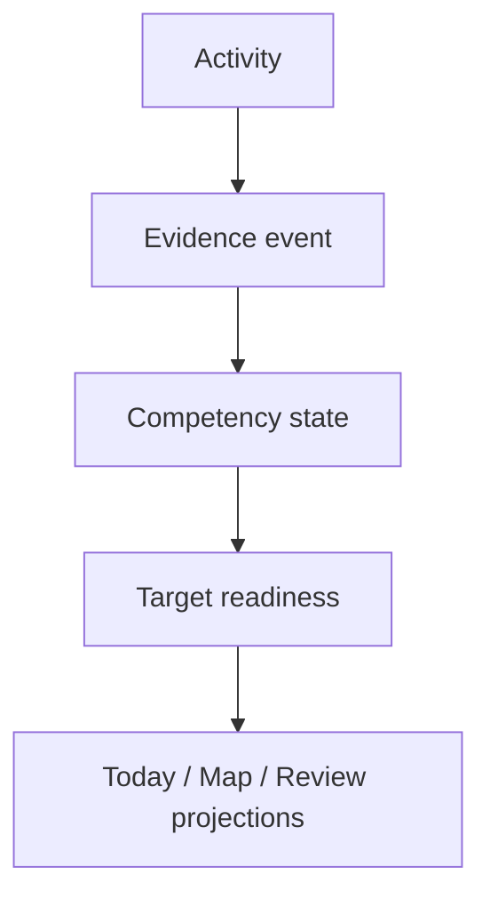

# PANDO — Project Documentation

Status: product and architecture baseline v0.3
Date: 2026-08-25

## Product in one sentence

PANDO is an evidence-first learning and planning system that turns a canonical competency graph, real learning evidence, retention, and changing life goals into an explainable daily plan that can be managed either manually or through short authenticated ChatGPT Work/Codex text or voice instructions.

It is **not** a task tracker with a decorative skill tree and it does **not** predict the probability of receiving an offer.

## Canonical documentation set

The canonical product baseline contains exactly nine Markdown files:

1. [`README.md`](README.md) — this index and the cross-document decision summary.
2. [`00_PRODUCT_CONSTITUTION.md`](00_PRODUCT_CONSTITUTION.md) — non-negotiable product principles and scope.
3. [`01_DOMAIN_MODEL.md`](01_DOMAIN_MODEL.md) — ownership, entities, cardinality, events, states, and calculations.
4. [`02_PRODUCT_AND_UX_SPEC.md`](02_PRODUCT_AND_UX_SPEC.md) — surfaces, flows, interaction rules, and acceptance criteria.
5. [`03_SYSTEM_ARCHITECTURE.md`](03_SYSTEM_ARCHITECTURE.md) — boundaries, data flow, security, integrations, and implementation shape.
6. [`04_MVP_DELIVERY_PLAN.md`](04_MVP_DELIVERY_PLAN.md) — phases, vertical slices, release scope, and definition of done.
7. [`05_EXTERNAL_AI_PREPARATION_PACK.md`](05_EXTERNAL_AI_PREPARATION_PACK.md) — zero-API-cost workflow for generating and importing vacancy or Growth Plan proposals.
8. [`06_PROMPT_LIBRARY_UX.md`](06_PROMPT_LIBRARY_UX.md) — user-facing prompt catalog for creating project-compatible proposal files through ChatGPT Work.
9. [`../SOFTWARE_PROJECT_GUIDELINES.md`](../SOFTWARE_PROJECT_GUIDELINES.md) — mandatory engineering, security, testing, review, release, and AI-agent execution standards.

For any product-semantic, architecture, ownership, or cross-context change, implementation agents
read `00` through `06` in numeric order, then the engineering guideline. A narrowly scoped
implementation task still begins here and in the Phase 0 baseline, then follows the smallest complete
route in the [module topology and reading map](design/MODULE_TOPOLOGY.md). If the task can affect
more than one route or reinterpret a product rule, read the complete canonical set.

Implementation records under [Phase 0 Technical Baseline](PHASE_0_TECHNICAL_BASELINE.md), [adr/](adr/),
[design/](design/), and [policies/](policies/) are supporting documents, not additional canonical
product documents. Module interaction and projection ownership are recorded in [ADR-0009](adr/0009-module-topology-and-projection-ownership.md)
and the [module topology](design/MODULE_TOPOLOGY.md). Agent Control is detailed in
[ADR-0008](adr/0008-agent-control-plane.md) and the
[Agent Control Plane design](design/AGENT_CONTROL_PLANE.md). Supporting documents may select
implementation mechanisms but may not change product semantics. The remaining Phase 4 lifecycle
transitions, owner-command protocol, preview boundary, and ordered implementation slices are
recorded in the supporting
[Phase 4B lifecycle command design](design/PHASE_4B_LIFECYCLE_COMMANDS.md).

[Phase 4B D2a Growth Plan weekly-capacity design](design/PHASE_4B_D2A_GROWTH_PLAN_CAPACITY.md).
Its delivered slices and verification evidence are tracked in the
[Phase 4B lifecycle command status](implementation/PHASE_4B_LIFECYCLE_COMMANDS_STATUS.md).
The completed weekly-capacity slice is recorded in the
[Phase 4B D2a implementation status](implementation/PHASE_4B_D2A_GROWTH_PLAN_CAPACITY_STATUS.md).
The completed Learning Track lifecycle slice is defined by
[Phase 4B D2b1 Learning Track pause/resume](design/PHASE_4B_D2B1_LEARNING_TRACK_LIFECYCLE.md) and
recorded in the
[Phase 4B D2b1 implementation status](implementation/PHASE_4B_D2B1_LEARNING_TRACK_LIFECYCLE_STATUS.md).
The completed settings slice is defined by
[Phase 4B D2b2 Learning Track priority and protected minimum](design/PHASE_4B_D2B2_LEARNING_TRACK_PRIORITY_MINIMUM.md)
and recorded in the
[Phase 4B D2b2 implementation status](implementation/PHASE_4B_D2B2_LEARNING_TRACK_PRIORITY_MINIMUM_STATUS.md).
The completed fresh-user setup slice is defined by
[Phase 4B D1b first Growth Plan setup](design/PHASE_4B_D1B_FIRST_GROWTH_PLAN_SETUP.md) and recorded in
the [D1b implementation status](implementation/PHASE_4B_D1B_FIRST_GROWTH_PLAN_SETUP_STATUS.md).
Manual activity admission is defined by the accepted
[Phase 4B manual activity admission design](design/PHASE_4B_MANUAL_ACTIVITY_ADMISSION.md) and
recorded in the
[manual activity admission implementation status](implementation/PHASE_4B_MANUAL_ACTIVITY_ADMISSION_STATUS.md).
Additional Track creation is defined by the accepted
[Phase 4B D2b3 additional Learning Track creation and destination-track admission design](design/PHASE_4B_D2B3_ADDITIONAL_LEARNING_TRACKS.md)
and recorded in the completed
[D2b3 implementation status](implementation/PHASE_4B_D2B3_ADDITIONAL_LEARNING_TRACKS_STATUS.md).
Terminal Track lifecycle is defined by the accepted
[Phase 4B D2b4 Learning Track completion and archive design](design/PHASE_4B_D2B4_LEARNING_TRACK_TERMINAL_LIFECYCLE.md).
Its delivered command, bounded history, UI, and verification evidence are recorded in the
[D2b4 implementation status](implementation/PHASE_4B_D2B4_LEARNING_TRACK_TERMINAL_LIFECYCLE_STATUS.md).
The adjacent activity-admission permission cleanup is recorded in the
[Phase 4B owner-boundary hardening status](implementation/PHASE_4B_ACTIVITY_ADMISSION_OWNER_BOUNDARY_HARDENING_STATUS.md).

If documents conflict, earlier product documents in this list have precedence over later product documents. `SOFTWARE_PROJECT_GUIDELINES.md` governs implementation and delivery but must not silently contradict product semantics. Stop and record the conflict instead of guessing.

## Core mental model

The immutable evidence history is the source of truth. Completion, mastery, readiness, recommendations, and visual state are derived projections.

## First release outcome

A signed-in user can select a seeded target or import a Preparation Pack, start from a versioned roadmap, record meaningful evidence manually, see explainable competency/readiness states, receive a deterministic next-best-action plan, complete a focus session, and manage a unified review queue. The same user can connect ChatGPT Work/Codex, ask for the plan in a few words, and preview/confirm lifecycle-safe changes through the same commands as the UI. Voice uses that flow only in client modes that expose PANDO tools; unsupported voice modes make no change and hand off clearly. The release includes a tested PyPrep contract and manual fallback; a live PyPrep connection ships only when its source is available and passes the same gates.

The first release must remain useful without AI, without the agent connector, and without unofficial LeetCode synchronization.

## Current canonical decisions

- Modular monolith, Postgres/Supabase, background jobs, event contracts, and transactional outbox.
- Canonical competency DAG plus target-profile projections; no separate graph per company.
- Versioned templates plus user overlay; no full mutable roadmap copy per user.
- Evidence-first mastery; `Unknown` is distinct from a low score.
- Deterministic calculations; AI explains and proposes but does not establish truth.
- ChatGPT Work/Codex is an authenticated external client: compact context, focused tools, exact preview, explicit confirmation, ordinary commands, and full UI parity.
- Graphify maps repository code/docs for agent orientation and token reduction; it never contains or authorizes live user state.
- PANDO is primarily a hosted responsive web application. Preparation Packs are imported by browser upload; a local folder watcher is development convenience only.
- Desktop-first graph; mobile-quality Today, Review, Focus, and notes. An embedded Learning Partner is optional and not a release dependency.
- Stable deterministic layout, semantic zoom, visible-subgraph rendering, and reduced-motion support.
- Provider abstraction; manual operation always works.
- MVP uses externally generated, file-based Preparation Packs; a built-in paid AI API is optional and deferred.
- Phase 0 uses Next.js 16, React, strict TypeScript, pnpm, Vercel Hobby, and Supabase Free. The accepted choices, limits, and exit paths are indexed in [Phase 0 Technical Baseline](PHASE_0_TECHNICAL_BASELINE.md).

## v0.3 architecture review resolutions

| Review topic | Canonical resolution |
|---|---|
| Documentation index | Nine canonical files: `docs/README.md`, `docs/00–06`, and the root engineering guideline. |
| Target Profile owner | `Targets` exclusively owns profile series, versions, drafts, and requirements; `Catalog` owns the canonical knowledge/activity catalog and roadmap templates. |
| Evidence boundary | Session lifecycle and raw provider imports are not evidence. Only normalized, typed observations enter the ledger. |
| Transactional outbox | A minimal outbox ships in Phase 0; Phase 6 hardens retry, replay, monitoring, and dead-letter handling. |
| Release gates | Manual evidence, PyPrep contract/mock, template migration, responsive core surfaces, and external pack confirmation are unconditional; live PyPrep and embedded AI are conditional. |
| Product/deployment form | Hosted responsive web application; browser file upload is canonical. Local watchers are development/self-hosted convenience only. |
| Imported content | Vacancy profiles and unknown competencies are staged and published as workspace-scoped personal content, never directly as canonical content. |
| Goal/cardinality model | One active Growth Plan and at most one active Interview Campaign in MVP; exact ownership of deadline, capacity, profile version, and overrides is defined in the Domain Model. |
| Phase dependency | Session/evidence precedes Review Core; Review Core precedes Planning; Today later enters the already-built Focus lifecycle. |
| Agent control | External ChatGPT Work/Codex is a first-class client over a compact control context and preview/confirm/apply ChangeSet contract. Voice uses the same path only where the client mode exposes PANDO tools; otherwise it performs no change and hands off. All supported clients use the UI's domain commands and require no embedded PANDO model. |
| Repository graph | Graphify is a secret-safe, regenerable orientation index for code/docs. It is separate from the competency graph, UI GraphProjection, and live control context. |

## Explicit non-goals for MVP

- Offer-probability prediction.
- Scraping or private LeetCode APIs.
- Microservices or a graph database.
- A permanent force-directed graph simulation.
- AI-controlled mastery, hidden plan changes, or opaque readiness scores.
- Direct agent mutation of database tables, exported state files, Graphify output, or repository documents as a substitute for PANDO commands.
- Full internal coding judge, public portfolio, mentor dashboard, or multi-company simulator.
- Heavy XP, coins, streak punishment, or achievements for low-value clicks.
