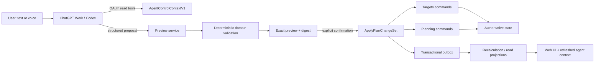

# PANDO Agent Control Plane — design contract

Status: Accepted implementation design
Decision: [ADR-0008](../adr/0008-agent-control-plane.md)
Canonical semantics: [Product Constitution](../00_PRODUCT_CONSTITUTION.md), [Domain Model](../01_DOMAIN_MODEL.md), [UX Specification](../02_PRODUCT_AND_UX_SPEC.md)

## 1. Outcome

A connected ChatGPT Work or Codex client can understand the user's current PANDO state from a small response, explain it, and safely make the same plan changes available in the web UI. Short typed and voice requests are first-class. PANDO remains useful without the connector and never pays for or trusts an embedded model.

## 2. Boundary map

The browser UI enters at the same preview/application services. No agent-specific business mutation exists.
Agent Control's coordinator dependencies and the owning modules behind each arrow are defined in the
[module topology](MODULE_TOPOLOGY.md) and [ADR-0009](../adr/0009-module-topology-and-projection-ownership.md).

## 3. Context layers

### Root summary

`AgentControlContextV1` is capped at 12 KiB as UTF-8 JSON and should normally remain below 3,000 model tokens. It contains only:

- contract version, generated time, ETag, projection watermark, workspace time zone;
- stable identifiers and aggregate versions;
- one active or paused Growth Plan and its compact track summaries;
- zero or one active Interview Campaign;
- goal titles/kinds/statuses, deadlines, capacity, protected minima, and explicit constraints;
- current top blockers, unknown/stale counts, and near-term action summaries;
- available operation capabilities and opaque detail references.

The server orders all arrays by stable identifiers or a documented ranking key. Unknown values are explicit `null`/status values, never fabricated zeros.

### Selective detail

Fetch detail only when material to the request:

| Resource | Purpose | Excluded by default |
|---|---|---|
| Goal context | Exact target/profile version, deadline, lifecycle, constraints | unrelated goals |
| Track context | Cadence, allocation, competency collection, current status | raw evidence |
| Campaign context | Overrides, blockers, stages, target freshness | conversation history |
| Today explanation | candidates, reasons, constraints, calculation version | notes |
| Evidence summary | bounded provenance/freshness aggregates | raw bodies and provider payloads |

Every detail resource repeats authorization and returns its own version/watermark. A foreign or missing identifier produces the same non-enumerating error shape.

### Incremental refresh

Clients send ETag or `changed_since`. If nothing material changed, return `not_modified`. After application, return the resulting plan revision and new watermark so the client refreshes only affected resources.

## 4. ChangeSet contract

A proposal has:

- `change_set_id`, schema version, workspace-bound server identity;
- source client (`web | chatgpt_work | codex | api`);
- user-stated reason and optional client correlation ID;
- base projection watermark;
- ordered semantic operations;
- expected aggregate version for every touched aggregate;
- warnings and material unknowns;
- deterministic preview digest, expiry, and confirmation requirements.

The model may draft operation arguments, but the server resolves ownership, validates references, calculates effects, and creates the digest.

### Initial operation catalog

| Operation | Owner | Historical behavior |
|---|---|---|
| Create/supersede Outcome Goal | Targets | superseded goal retained |
| Create/supersede Readiness Goal | Targets | old exact profile reference retained |
| Start/end/cancel Interview Campaign | Targets | campaign and reason retained |
| Change campaign deadline/target overrides | Targets | revision records before/after |
| Create/pause/resume/archive Growth Plan | Planning | archived revisions retained |
| Create/pause/resume/complete/archive Learning Track | Planning | track history retained |
| Change default capacity or dated availability | Planning | prior revision retained |
| Change cadence, protected minimum, priority, allocation | Planning | prior revision retained |
| Accept staged personal content | Targets/User Overlay | import decision audit retained |

No operation sets mastery, readiness, review dates, evidence, completed work, or canonical catalog truth directly. Those remain owned or derived through their ordinary contracts.

### Preview response

The preview must answer:

- What will be created, changed, paused, resumed, ended, cancelled, archived, or superseded?
- What explicitly remains unchanged?
- Which temporary overrides disappear?
- How does weekly capacity and Today ranking change?
- Which history/evidence survives?
- Which assumptions are uncertain or stale?
- Does a target/profile import need the separate Preparation Pack path?
- What exact user confirmation is required?

A preview has no authoritative side effect except a short-lived auditable draft record.

### Confirmation and application

Reads need no confirmation. Every persisted ChangeSet needs explicit confirmation of the exact preview. One short confirmation such as “apply” or “yes” is sufficient after the client has shown the before/after summary. High-impact operations are not allowed to hide inside a larger low-risk set.

`apply_change_set` requires:

- server-issued change set ID and preview token;
- preview digest and unexpired confirmation;
- expected versions and base watermark;
- idempotency key;
- current OAuth session.

The application transaction writes all owning-context state changes, plan revision, command receipt, and outbox events together. On any failure it writes none. Replaying the same idempotency key and request returns the original result; reusing it with different content conflicts.

## 5. Focused tool surface

| Tool | Kind | Notes |
|---|---|---|
| `get_control_summary` | read | first call for almost every request |
| `get_goal_context` | read | one goal/campaign/track expansion |
| `explain_today` | read | deterministic reasons and versions |
| `get_change_status` | read | pending recalculation or final revision |
| `preview_create_goal` | proposal | common focused creation |
| `preview_change_goal` | proposal | deadline, target, constraints, priority |
| `preview_close_goal` | proposal | end/cancel/pause/archive/supersede |
| `preview_change_set` | proposal | atomic multi-operation scenario |
| `apply_change_set` | write | only confirmed mutation tool |

Read tools and proposal tools cannot persist domain state. The write tool cannot change the proposal. Tool descriptions state consequences and confirmation requirements in their first sentences.

## 6. Natural-language examples

### Interview cancelled

Input: “The interview was cancelled.”

Expected behavior:

1. Load the root summary; if exactly one campaign is active, no extra identity question is needed.
2. Preview `cancel_campaign` with user reason.
3. Show removal of campaign requirement/allocation overrides, restoration of base Growth Plan allocation, affected Today recommendations, and retained evidence/readiness goal.
4. Ask for one explicit confirmation.
5. Apply and report the plan revision plus refreshed next action.

### New university/specialty, three months

Input: “I need to switch university and specialty; I have three months.”

Expected behavior:

1. Load the root summary and relevant current goal/track detail.
2. Ask only for the target university/specialty and hard deadline if they cannot be inferred safely.
3. If substantial target research is required, route that portion to a Preparation Pack while still allowing immediate capacity/deadline changes through ChangeSet.
4. Preview goal supersession or creation, track changes, protected minima, capacity trade-offs, and unaffected work.
5. Confirm and apply atomically.

### Stop an old activity area

Input: “Stop interview prep; keep Python and ML.”

Expected behavior:

- resolve “interview prep” to the active campaign, not every shared competency;
- cancel/end the campaign and remove only its temporary overrides;
- keep Python/ML tracks and all shared evidence;
- call out ambiguity if “stop” could mean a permanent track archive.

## 7. Authentication and authorization

- Hosted MCP uses OAuth 2.1 authorization for the signed-in PANDO user.
- The server resolves workspace membership; caller-supplied workspace IDs are filters, never authority.
- Read and write scopes are separate.
- Ordinary tools call no service-role mutation path.
- Revocation disables future calls without changing PANDO data.
- Rate limits apply per user, OAuth client, and workspace.
- Logs contain IDs, timings, result classes, and schema versions, not private payload bodies.

## 8. Repository orientation

The project-local `pando-control` skill teaches the workflow above. The project-local `graphify` wrapper uses the pinned third-party Graphify CLI to answer repository architecture questions before broad file reading.

The four graphs remain separate:

| Graph | Meaning | Authority |
|---|---|---|
| Competency DAG | prerequisites and knowledge structure | Catalog |
| GraphProjectionV1 | workspace-filtered Map/Outline UI response | server read model |
| AgentControlContextV1 | compact live plan/control read model | server read model |
| Graphify repository graph | code/document relationships | regenerable developer index |

Graphify output must be refreshed after material architecture changes and verified against source files. It never includes live plan data and never drives product commands.

## 9. Required tests

- root context schema and 12 KiB budget;
- deterministic ordering, ETag, and `changed_since`;
- two-user/two-workspace positive and negative authorization;
- foreign-ID non-enumeration;
- stale aggregate version, stale watermark, expired preview, changed digest, and missing confirmation;
- same-key replay and changed-request conflict;
- injected failure after every operation boundary proves full rollback;
- effect plus consumer receipt atomicity for asynchronous projections;
- UI and agent parity for each operation;
- cancelled-interview and three-month-specialty end-to-end scenarios;
- connector/model unavailable leaves all manual flows usable;
- Graphify ignore policy excludes secrets, local credentials, user exports, build output, and generated control data.

## 10. Delivery order

1. Freeze context and ChangeSet schemas plus fixtures.
2. Implement read projection and size/determinism tests.
3. Implement Phase 4 lifecycle commands and deterministic preview.
4. Implement atomic `ApplyPlanChangeSet` and plan revision audit.
5. Add local CLI adapter and project skill.
6. Add OAuth MCP adapter and focused tools.
7. Add UI parity surfaces and acceptance tests.
8. Run security review, voice/typed scenario checks, observability, and rollback rehearsal.
