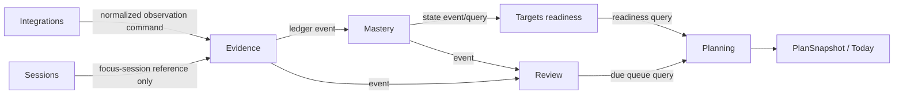
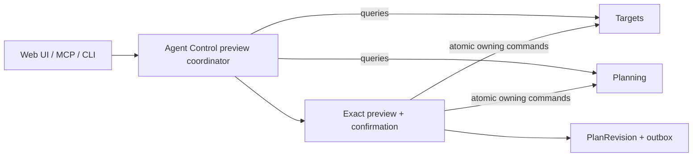
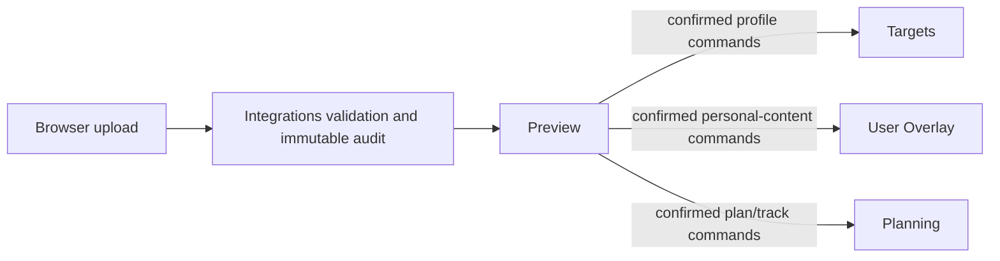

# PANDO module topology and reading routes

Status: Accepted implementation clarification
Decision: [ADR-0009](../adr/0009-module-topology-and-projection-ownership.md)
Canonical authority: [Domain Model](../01_DOMAIN_MODEL.md) and
[System Architecture](../03_SYSTEM_ARCHITECTURE.md)

## 1. Purpose

This document gives implementation agents one bounded map from a requested outcome to the owning
module, allowed interaction form, decisive contract, and next documents to read. It does not add a
bounded context or replace the nine canonical documents.

Graphify may index this map for navigation, but the source files linked here remain authoritative.
The map describes repository architecture only; it is not the competency DAG, `GraphProjectionV1`,
`AgentControlContextV1`, authorization, or live user state.

## 2. Interaction rules

There are four allowed forms of cross-context interaction:

1. **Command** — a state-changing request handled and validated by the module that owns the
   aggregate. State, command receipt, and outbox events commit atomically.
2. **Query** — a bounded read contract exposed by an owning module. Consumers do not read another
   module's private tables.
3. **Versioned event** — an immutable fact published through the outbox. Consumers remain
   idempotent and reload authoritative input when ordering matters.
4. **Read projection composition** — a read-only application component joins bounded query/read
   models for one client contract. It owns no source facts and cannot write across contexts.

Domain code imports no other context. An application coordinator may call multiple public module
interfaces only for a named workflow such as `ApplyPlanChangeSet` or Preparation Pack activation.
It may enforce workflow atomicity, but it does not acquire ownership of the participating facts.
Infrastructure implements ports and persistence for its own module; it never becomes a shortcut to
another module's tables.

## 3. Bounded-context topology

| Context                                                      | Authoritative responsibility                                                                                                      | Consumes through contracts                                                                    | Publishes or exposes                                                                   |
| ------------------------------------------------------------ | --------------------------------------------------------------------------------------------------------------------------------- | --------------------------------------------------------------------------------------------- | -------------------------------------------------------------------------------------- |
| [Identity & Workspace](../../src/modules/identity/README.md) | users, workspaces, membership, roles, preferences                                                                                 | authentication subject                                                                        | membership/authorization queries and membership events                                 |
| [Catalog](../../src/modules/catalog/README.md)               | canonical competencies, DAG, activities, resources, roadmap template versions                                                     | curator commands                                                                              | exact-version catalog queries and catalog/template events                              |
| [Targets](../../src/modules/targets/README.md)               | outcome/readiness goals, campaigns, target profiles/requirements, target-specific readiness snapshots                             | Catalog references and Mastery state projections                                              | goal/profile/campaign commands, readiness queries, lifecycle/readiness events          |
| [User Overlay](../../src/modules/overlay/README.md)          | workspace-scoped competencies, activities, mappings, edges, notes, exclusions, positions                                          | exact Catalog/Targets references                                                              | personal-content commands, overlay queries, overlay-version events                     |
| [Sessions](../../src/modules/sessions/README.md)             | focus-session lifecycle and time capture                                                                                          | Catalog or User Overlay activity references and plan action references                        | session commands and operational lifecycle events; never attempts or evidence facts    |
| [Integrations](../../src/modules/integrations/README.md)     | provider accounts/cursors/inbox, raw Preparation Packs, validation/import audit                                                   | provider payloads and module validation interfaces                                            | normalized observation commands to Evidence; import status and activation coordination |
| [Evidence](../../src/modules/evidence/README.md)             | attempts plus immutable normalized evidence and corrections                                                                       | Catalog activity-to-competency mappings and normalized observations                           | evidence commands, ledger queries, append/correction/invalidation events               |
| [Mastery](../../src/modules/mastery/README.md)               | derived competency states, dimensions, freshness, estimate confidence                                                             | Evidence events and versioned policy                                                          | competency-state projections and change events                                         |
| [Review](../../src/modules/review/README.md)                 | review items, reasons, scheduling lifecycle and deduplication                                                                     | Evidence/Mastery changes and Targets deadlines                                                | review commands, due-queue queries, review-item events                                 |
| [Planning](../../src/modules/planning/README.md)             | Growth Plan, Learning Tracks, capacity/availability, campaign allocation overrides, ranking, `PlanSnapshot` and Today explanation | Catalog candidates, Targets readiness/campaign state, Mastery, Review and Overlay read models | plan/track/capacity commands, Today/plan queries, plan events                          |
| [Agent Control](../../src/modules/agent-control/README.md)   | compact control context, ChangeSets, confirmations, plan revisions and purpose-specific cross-module coordination                 | authorized Targets, Planning, Review and readiness queries                                    | `AgentControlContextV1`, deterministic preview, `ApplyPlanChangeSet`; no domain truth  |

## 4. Derived contract ownership

Derived outputs need an explicit contract owner even though they are rebuildable:

| Contract or output                          | Contract owner                                             | Source owners                                                  | Authority rule                                                   |
| ------------------------------------------- | ---------------------------------------------------------- | -------------------------------------------------------------- | ---------------------------------------------------------------- |
| `CompetencyState`                           | [Mastery](../../src/modules/mastery/README.md)             | Evidence, Catalog policy references                            | cannot append or correct evidence                                |
| target readiness snapshot                   | [Targets](../../src/modules/targets/README.md)             | immutable Target Profile plus Mastery states                   | cannot mutate Mastery or complete an Outcome Goal                |
| `ReviewItem` queue                          | [Review](../../src/modules/review/README.md)               | Evidence, Mastery, Targets deadline events                     | scheduling is not mastery truth                                  |
| `PlanSnapshot` and Today explanation        | [Planning](../../src/modules/planning/README.md)           | Targets readiness, Review, Catalog, Mastery, Overlay, capacity | ranking cannot invent evidence or requirements                   |
| `GraphProjectionV1`                         | server-side Explore read-projection composer               | Catalog, Targets, Overlay, Mastery, Review                     | UI contract only; owns no domain rows                            |
| `AgentControlContextV1` and `PlanChangeSet` | [Agent Control](../../src/modules/agent-control/README.md) | minimized authorized queries from owning modules               | context is read-only; apply delegates to owning commands         |
| Preparation Pack validation/preview         | [Integrations](../../src/modules/integrations/README.md)   | pack schemas plus Targets, Overlay and Planning validation     | imported output is untrusted until confirmed owning commands run |

The Explore composer is a read-only application projection, not a twelfth bounded context. Agent
Control is a bounded context because it owns persisted proposal, confirmation, revision, and
coordination lifecycle; it still owns none of the goals or plans it coordinates.

## 5. Principal flows

### Evidence to daily action

`Sessions` lifecycle events and raw provider inbox records do not enter the evidence ledger.

### Live plan change

The same workflow serves manual and agent clients. No client-specific mutation path is permitted.

### Preparation Pack activation

Targets, User Overlay, and Planning validate and own the resulting state. Integrations owns the raw
pack and import decision, not the accepted profile, competency, or plan.

## 6. Task-oriented reading routes

Always start with [the canonical index](../README.md) and the
[Phase 0 Technical Baseline](../PHASE_0_TECHNICAL_BASELINE.md). Then use the smallest route that
covers the outcome:

| Outcome                                         | Owning route                                                                                                                                                                                                                                                      |
| ----------------------------------------------- | ----------------------------------------------------------------------------------------------------------------------------------------------------------------------------------------------------------------------------------------------------------------- |
| evidence, attempts, mastery or corrections      | [Domain Model](../01_DOMAIN_MODEL.md) → [ADR-0003](../adr/0003-commands-outbox-and-jobs.md) → [ADR-0006](../adr/0006-calculation-and-review-engines.md) → [Evidence](../../src/modules/evidence/README.md) and [Mastery](../../src/modules/mastery/README.md)     |
| readiness, target profile or campaign           | [Domain Model](../01_DOMAIN_MODEL.md) → [System Architecture](../03_SYSTEM_ARCHITECTURE.md) module contracts → [ADR-0006](../adr/0006-calculation-and-review-engines.md) → [Targets](../../src/modules/targets/README.md)                                         |
| review queue or scheduling                      | [Domain Model](../01_DOMAIN_MODEL.md) → [UX Review Center](../02_PRODUCT_AND_UX_SPEC.md) → [review policy](../policies/REVIEW_POLICY_V0.1.md) → [Review](../../src/modules/review/README.md)                                                                      |
| Growth Plan, tracks, capacity, Today or ranking | [Domain Model](../01_DOMAIN_MODEL.md) planning contract → [UX Today](../02_PRODUCT_AND_UX_SPEC.md) → [Planning](../../src/modules/planning/README.md)                                                                                                             |
| Map, Outline or graph performance               | [UX Explore](../02_PRODUCT_AND_UX_SPEC.md) → [ADR-0004](../adr/0004-graph-layout-and-query-boundary.md) → [GraphProjectionV1 schema](../../schemas/graph-projection/v1/README.md)                                                                                 |
| plan lifecycle/editing and short text/voice control | [Constitution P17](../00_PRODUCT_CONSTITUTION.md) → [Domain Model Agent Control](../01_DOMAIN_MODEL.md) → [ADR-0008](../adr/0008-agent-control-plane.md) → [Phase 4B lifecycle design](PHASE_4B_LIFECYCLE_COMMANDS.md) → [Agent Control design](AGENT_CONTROL_PLANE.md) and [schemas](../../schemas/agent-control/v1/README.md) |
| Preparation Pack or Prompt Library              | [Domain Model import semantics](../01_DOMAIN_MODEL.md) → [Preparation Pack](../05_EXTERNAL_AI_PREPARATION_PACK.md) → [Prompt Library](../06_PROMPT_LIBRARY_UX.md) → [ADR-0005](../adr/0005-preparation-pack-ingestion.md)                                         |
| tenancy, RPC, outbox or jobs                    | [System Architecture](../03_SYSTEM_ARCHITECTURE.md) security/contracts → [ADR-0002](../adr/0002-auth-data-access-and-tenancy.md) → [ADR-0003](../adr/0003-commands-outbox-and-jobs.md) → migrations and database tests                                            |

Read all nine canonical documents in their declared order when the requested change can alter
product semantics, bounded-context ownership, a cross-context workflow, or more than one route.

## 7. Change checks

Before adding a dependency or workflow, answer:

- Which context owns every authoritative write?
- Is the interaction a command, query, versioned event, or read projection?
- Can any caller bypass authorization, expected versions, idempotency, or outbox atomicity?
- Does a read projection accidentally become a second source of truth?
- Does a coordinator retain workflow/audit state only, rather than copy domain ownership?
- Can the change be tested without importing another module's infrastructure?

If no existing owner fits, stop and create a superseding ADR instead of placing the behavior in
`shared`, a generic service, a projection, or Agent Control.
